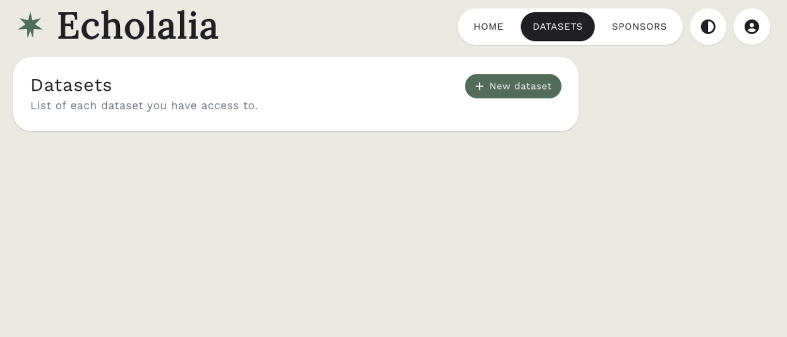
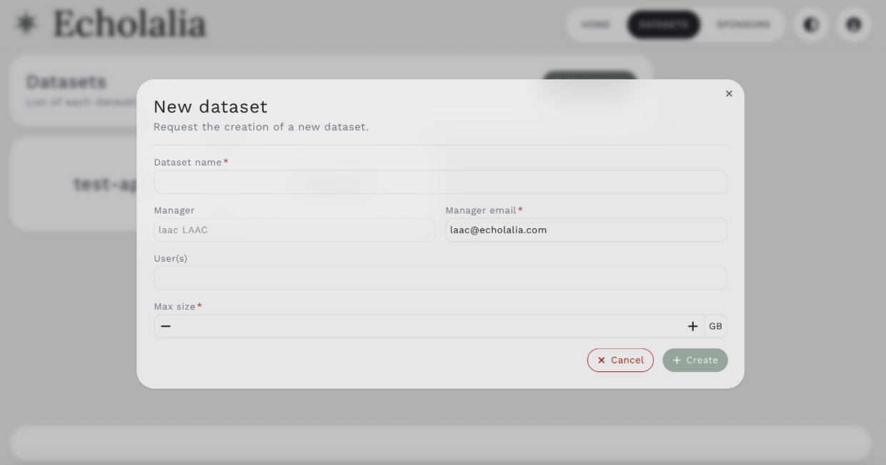
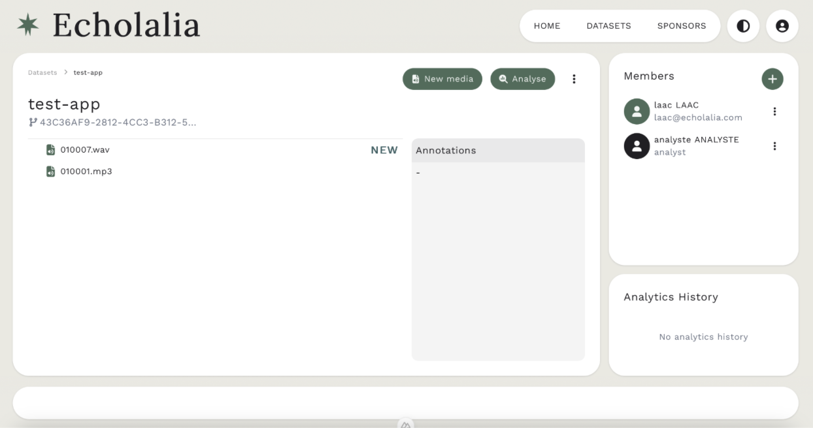
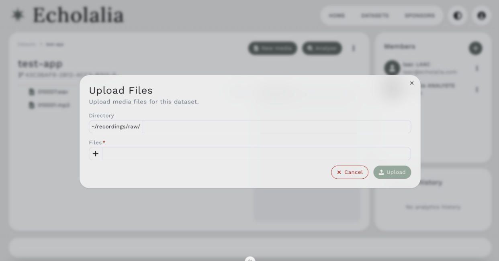

### Add a dataset

On the upper right, you’ll see HOME, DATASETS, SPONSORS. To get started with adding a dataset, click on the DATASETS button. Your screen should now appear like this (Figure 4): 

<figure markdown>
  <figcaption>Figure 4: Dataset Homepage</figcaption>
</figure>

### Create a new dataset 

To request the new creation of a dataset (which would need to be approved by an admin within 24-48 hours), click on the green button + New dataset. The screen should then appear as Figure 5.  

<figure markdown>
  <figcaption>Figure 5: To add a new dataset</figcaption>
</figure>

Fill in the information (i.e., Dataset name, User(s), and Max Size). Once you do this, the admin will approve it (or contact you if there are any issues within 24-48 hours). Once it’s created, it should look like Figure 6. 

<figure markdown>
  <figcaption>Figure 6: Creation of an empty new dataset</figcaption>
</figure>

### Add new media to dataset

Once your dataset is approved, you can upload (individually or batched) large audio files (mp3, wav) with a maximum size of 2 GB each file. To do so, click on the New Media button to add audio files (Figure 7). 

<figure markdown>
  <figcaption>Figure 7: Adding new media</figcaption>
</figure>
