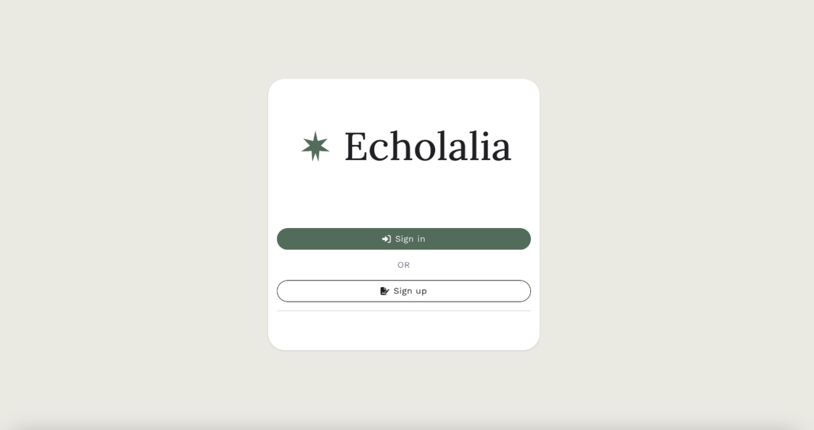

## Prerequisites & Requirements:

### Data on Scientific Repositories:

We require that you deposit your data onto scientific repositories because ELSI does not handle legal or ethical permissions for data reuse. You must deposit your dataset in one of:

1. [HomeBank](https://homebank.talkbank.org/)
2. [Databrary](https://databrary.org/)
3. [The Language Archive](https://archive.mpi.nl/)

All three support long-form recordings and allow you to control who can legally access your data. Datasets not in any archive will be removed from ELSI. When using the scientific archives, you must link our lab as a collaborator. 

### Account & Access:

In order to use ELSI, we recommend the Chrome browser. 

If it’s your first time, you will need to sign up. If not, sign in with your information. https://elsi-lscp.ddns.net/identify/login. An admin will need to approve your account for the first time which may take 24-48 hours. If you experience any delays, please contact Kaveri at ksheth2019@gmail.com. 

Once you have approval, you need to go here: https://elsi-lscp.ddns.net/maildev/#/email/abTJlKrh and use that first time password to connect and change it. 

To access the website, click on this link: https://elsi-lscp.ddns.net/identify/login. This is what the home page looks like (Figure 2).

<figure markdown>
  
  <figcaption>Figure 2: ELSI Homepage</figcaption>
</figure>

Once you log in, the screen should look Figure 3. 
