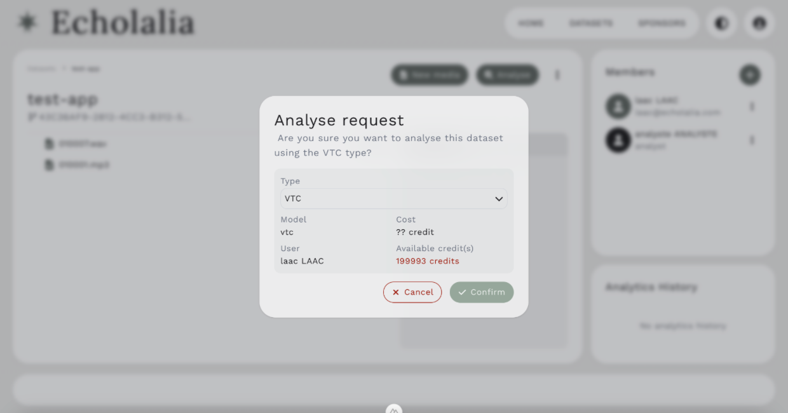
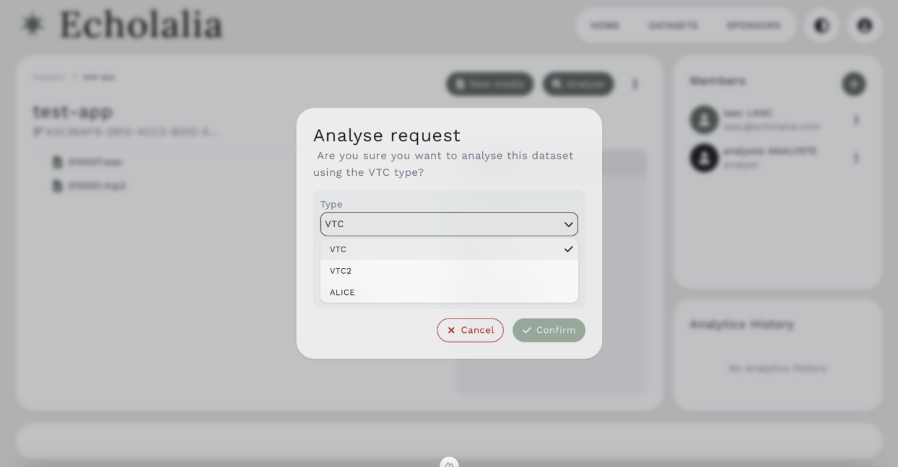
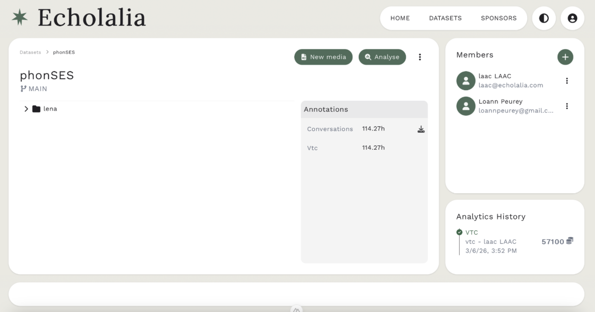
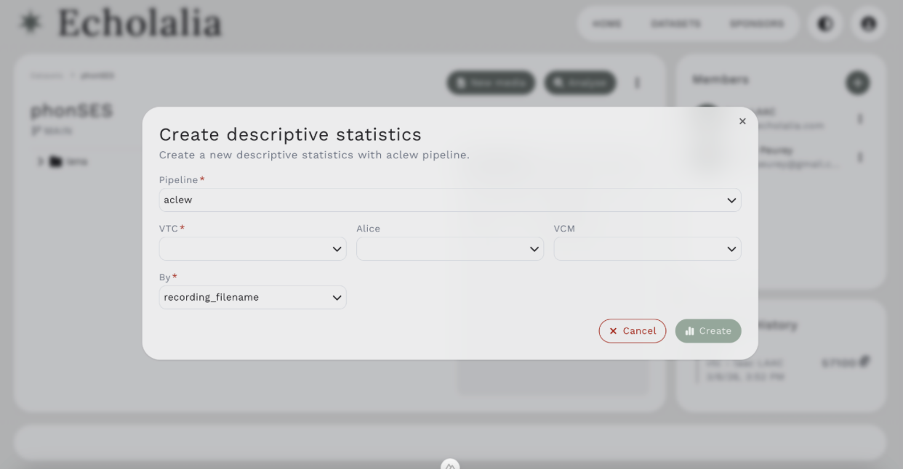

### Running Analyses

Once you have all of your files uploaded, you can run analyses. Click on the Analyse Button next to the New Media button. Once you do, your screen will look like Figure 8. 

<figure markdown>
  <figcaption>Figure 8: Analyse your audio</figcaption>
</figure>

You can choose which model to analyse the data with (i.e. VTC, VTC2, ALICE) (Figure 9). 

<figure markdown>
  <figcaption>Figure 9: Choosing which model to run</figcaption>
</figure>

Once the analysis is run, the annotations will show up in the box labeled “annotations” with the model you chose to run, and you can download the CSV files (Figure 10). 

<figure markdown>
  <figcaption>Figure 10: Annotations appear after model is run</figcaption>
</figure>

### Generating Statistics

You can also create descriptive statistics (Figure 11) by clicking the 3 buttons next to the green Analyse button. You can either create them with the aclew or LENA pipeline. Then choose which annotation set you are using for VTC, ALICE, or VCM, and then you can do the statistics by recording filename, child id, or session id. Once you do so, a csv file will be generated and automatically downloaded to your computer.

<figure markdown>
  <figcaption>Figure 11: Running descriptive statistics</figcaption>
</figure>

