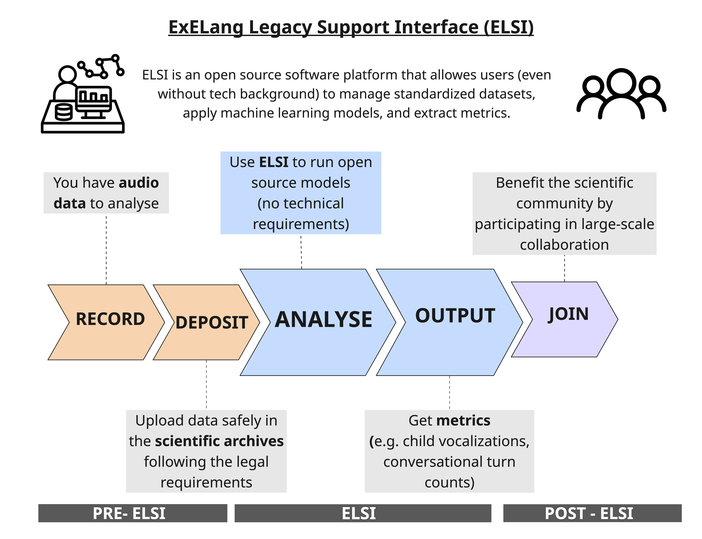

# ExELang Legacy Support Interface (ELSI) Documentation

Welcome to ExELang Legacy Support Interface (ELSI). The goal of this documentation is to provide details about the features of the tool and how to use them.

## Overview and Purpose:

Long-form recordings (LFRs) of children in naturalistic settings are a rich but difficult type of research data. Across the field, corpora vary widely in how they are organized, documented, and stored, making cross-corpus analysis error-prone and slow. The raw audio is ethically sensitive, yet most existing tools provide no built-in mechanism for enforcing tiered access based on consent and ethics protocols. And extracting meaningful metrics, through voice type classifiers, vocal maturity classifiers, or other ML models, demands technical expertise that many researchers may not have. 

ELSI (ExELang Legacy Support Interface) is a software platform enabling users, regardless of technical background, to manage standardized datasets, apply machine learning models, and extract metrics to child-centered long-form recordings. It builds on the ChildProject framework and DataLad infrastructure inheriting standardized metadata pipelines and versioning capabilities. 

Specifically, the ChildProject Python package for LFR data management addresses differences in structure and organization by enforcing a consistent directory structure and metadata schema across corpora. Each corpus follows a common schema with metadata at three levels: child (e.g., ID, date of birth), recording (e.g., recording ID, child ID, date), and annotation. The annotation-level metadata, generated automatically by ChildProject, maps each annotation file to its corresponding audio segment, since human annotations of LFRs typically cover only sampled audio sections rather than full recordings. DataLad adds git-based version control for annotations and git-annex for large file management, enabling nested dataset structures that support reproducibility.

<figure markdown>
  <figcaption>Figure 1: ELSI Ecosystem</figcaption>
</figure>
